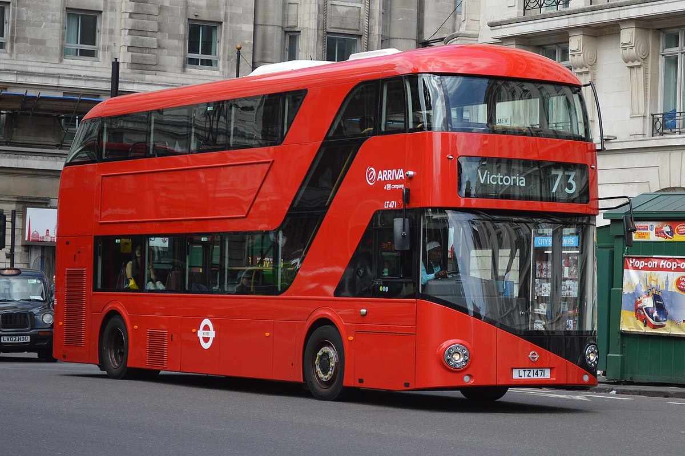
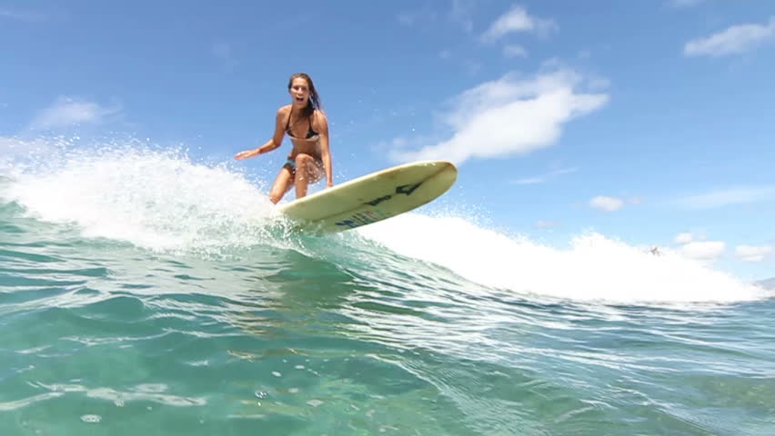

# Image Captioning

This application is to train, evaluate and infer image captioning.<br>
Image captioning takes images as input and return the caption of the images as output.<br>
This program is based on ["Show and Tell: A Neural Image Caption Generator" by Vinayls et al. (ICML2015)](https://www.cv-foundation.org/openaccess/content_cvpr_2015/papers/Vinyals_Show_and_Tell_2015_CVPR_paper.pdf), and implemented using "Pytorch".

You can download models here.
- Encoder CNN (50 MB): https://projects.n-hassy.info/storage/image-captioning/encoder.pth
- Decoder RNN (235 MB): https://projects.n-hassy.info/storage/image-captioning/decoder.pth

# DEMO

| |                     |
|:-------------------------------:|:-----------------------------:|
|a brown and white cat sitting in the grass    |a red double decker bus driving down a street |

| |                     |
|:-------------------------------:|:-----------------------------:|
|a group of people sitting around a table eating food            |a man riding a wave on top of a surfboard            |

# Requirement

- Python==3.8.5
- nltk==3.6.2
- numpy==1.20.3
- Pillow==8.2.0
- pycocotools==2.0.2
- torch==1.4.0
- torchvision==0.5.0
- torchtext==0.5.0
- tqdm==4.46.0

The versions of `torch`, `torchvision`, and `torchtext` can be changed to be compatible with the cuda version that you are using.<br>
Refer to the [official page](https://pypi.org/project/torchtext/) for the version of `torchtext`.

# Installation

1. Paste the following commands at a terminal prompt to download this source code.

	```bash
	$ git clone https://github.com/hashi0203/image-captioning.git
	```
2. Construct the environment.

	```bash
	$ cd image-captioning
	$ pip install -r requirements.txt
	```

3. Download 'punkt'.

	In the environment you want you use, please execute the following command.

	```bash
	$ python3 -c "import nltk; nltk.download('punkt')"
	```

# Usage

 - Train
	 1. Download datasets and captions.

		This application uses MSCOCO dataset, and you can download them from following links.<br>
		The train dataset is for training, the validation dataset is for evaluation, so you can download only what you need.<br>
		It may **take long time** to download and unzip all of the images (especially the training images).

		- [2014 Train images [83K/13GB]](http://images.cocodataset.org/zips/train2014.zip)
		- [2014 Val images [41K/6GB]](http://images.cocodataset.org/zips/val2014.zip)
		- [2014 Train/Val annotations [241MB]](http://images.cocodataset.org/annotations/annotations_trainval2014.zip)

		Make the data directory.
		```bash
		$ mkdir data
		$ cd data
		```

		Download and unzip train images.
		```bash
		$ wget http://images.cocodataset.org/zips/train2014.zip # train images
		$ unzip train2014.zip
		$ rm train2014.zip
		```

		Download and unzip test images.
		```bash
		$ wget http://images.cocodataset.org/zips/val2014.zip # test images
		$ unzip val2014.zip
		$ rm val2014.zip
		```

		Download and unzip annotations.
		```bash
		$ wget http://images.cocodataset.org/annotations/annotations_trainval2014.zip # annotations
		$ unzip annotations_trainval2014.zip
		$ rm annotations_trainval2014.zip
		````

	2. Place downloaded files under the 'data' directory following the directory tree.

		```bash
		|-- image-captioning
			|-- data
				|-- train
					|-- captions_train2014.json
					|-- images
						|-- COCO_train2014_{number}.jpg
						|-- ..
				|-- val
					|-- captions_val2014.json
					|-- images
						|-- COCO_val2014_{number}.jpg
						|-- ..
			|-- ..
		```

		Move the images and annotations.

		```bash
		$ mkdir train
		$ mv annotations/captions_train2014.json train
		$ mv train2014 train/images
		$ mkdir val
		$ mv annotations/captions_val2014.json val
		$ mv val2014 val/images
		$ rm -r annotations
		```

	3. Set (hyper)parameters in `config.py`.

		It is also ok if you don't edit anything.

	4. Start training by using the `Encoder CNN (ResNet152)` to change images to feature vectors and the `Decoder RNN (LSTM)` to change feature vectors to captions.

		```bash
		$ python3 main.py 'train'
		```

		Ref. It took 6.5 hours to complete with the default parameters by 4 GPUs in `NVIDIA TESLA P100 (Pascal)`. <br>
		Ref. Final loss was `1.9155` in this case.

	5. Model files are save in `image-captioning/model` if you didn't edit `config.py`.

- Evaluate
	1. Following 1, 2, 3 in Training section.

	2. Set (hyper)parameters in `config.py`.

		You should **specify the models** (both encoder and decode) you want you use.<br>
		You also have to be sure that the **parameters should be the same** as when training.

	3. Start evaluating using the `BLEU-4 score`.

		```bash
		$ python3 main.py 'eval'
		```

		Ref. It may **take long time** if you use all images, so I recommend you to save outputs by setting `LOG_STEP` and stop evaluating when the values are stable.<br>
		Ref. `BLEU-4 score` by 5000 images was 0.263 in this case.

	4. Output will be shown in stdout and also you can check it in `image-captioning/log/test_results.txt`.

- Infer
	1. Prepare images which you want to make captions of and place them in `image-captioning/images`.

	2. Set (hyper)parameters in `config.py`.

		You should **specify the models** (both encoder and decode) you want you use.<br>
		You also have to be sure that the **parameters should be the same** as when training.

	3. Start inferring by using `beam search`.
		```bash
		$ python3 main.py 'infer'
		```

	4. Output will be shown in stdout and also you can check it in `image-captioning/log/infer_results.txt`.

- Compare

	You can also compare outputs with different beam size.

	1. Set (hyper)parameters in `config.py`.

		You should **specify the models** (both encoder and decode) you want you use.<br>
		You also have to be sure that the **parameters should be the same** as when training.<br>
		The images are chosen from `image-captioning/data/val/images`.

	3. Start comparing.
		```bash
		$ python3 main.py 'compare'
		```

	4. Output will be shown in `image-captioning/log/compare_results.txt`.

# Reference
```bash
@article{DBLP:journals/corr/VinyalsTBE14,
  author    = {Oriol Vinyals and
               Alexander Toshev and
               Samy Bengio and
               Dumitru Erhan},
  title     = {Show and Tell: {A} Neural Image Caption Generator},
  journal   = {CoRR},
  volume    = {abs/1411.4555},
  year      = {2014},
  url       = {http://arxiv.org/abs/1411.4555},
  archivePrefix = {arXiv},
  eprint    = {1411.4555},
  timestamp = {Mon, 13 Aug 2018 16:47:52 +0200},
  biburl    = {https://dblp.org/rec/journals/corr/VinyalsTBE14.bib},
  bibsource = {dblp computer science bibliography, https://dblp.org}
}
```
